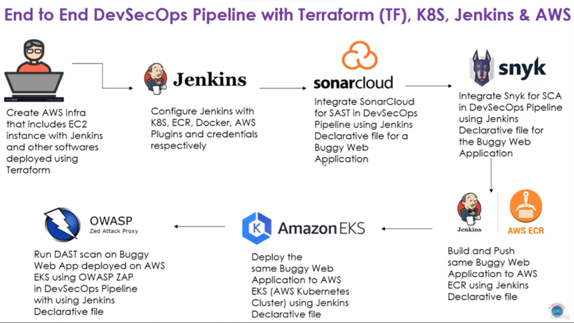

# DevSecOps Realtime Project

### End to End DevSecOps Pipeline with Terraform, Jenkins, Docker, Kubernetes and AWS.

## Install Terraform for windows

### Download terraform from below link

Create a new folder and copy the downloaded exe file. Add the path  to PATH environment variable.

## Create a free tier AWS account

Create a free tier account in AWS.

## Create admin user

#### 1. Go to 

#### 2. Create user

#### 3. Set Permissions

- Click on Attach policies directly
  

- Select AdministratorAccess from the list
  

- Create user
  

#### 4. Create access key
- Click on the user created
- Go to Security credentials
- Create Access key 
- Select Command Line Interface

- acess key is created and this can be viewed only once.
  

- copy the access key and secret access key and keep it saved.
  
## Install AWS CLI and authenticate with AWS.

Download msi file from below link.

#### 1.  Open command prompt
#### 2. Enter _aws configure_ in the command prompt.
#### 3. Enter the details as asked for.

#### 4. Test the configuration using any aws commands.

## Download and Install Visual Studio for Windows.

## Creating key pair for the ec2 instance

We will be using key pair to access the ec2 instance.

The key pair gets downloaded to the local system. Save it inside the current workind directory.

## Create AWS infrastructure using terraform

#### Terraform script main.tf 
This terraform file has the code to create aws ec2 on which we will install jenkins.

#### install.sh
This script has the code to install all required softwares - jdk, git, maven,jenkins, zap for DAST, aws cli etc

#### vars
This folder has tfvars file which is a variable file. It has the values defined for the variables declared in main.tf

### Terraform commands

__Step-1__ Initialize Terraform as backend
__terraform init -var-file="vars/dev-west-2.tfvars"__

__Step-2__ Plan resources
__terraform plan -var-file="vars/dev-west-2.tfvars"__

__Step-3__ Apply to create resources.
__terraform apply -var-file="vars/dev-west-2.tfvars"__

### Cleanup resources

__terraform destroy -var-file="vars/dev-west-2.tfvars"__

## Jenkins setup

Access Jenkins on the browser

Use the public DNS of ec2 instance created with port 8081. Make sure we use http , since we have not installed any security certificate.
for example: 
http://publicDNS:8081

### 1. Extract Initial admin password

Password location: /var/lib/jenkins/secrets/initialAdminPassword

command: sudo cat /var/lib/jenkins/secrets/initialAdminPassword

### 2. Install recommended plugins

### 3. Create Admin user and password

### 4. Configure Maven

Manage Jenkins __->__ Tools __->__ Add Maven

MAVEN_HOME we get from _mvn --version*_ command. See above screenshot.

### 5. Install Plugins

Manage Jenkins __->__ Plugins __->__ Available Plugins

__Plugins to be installed__
1. docker pipeline to build docker image
2. aws credentials - to perform any command in aws infrastructure
3. amazon ecr - generates docker authentication from aws credentials. 
4. Kubernetes CLI - to run k8s command.

